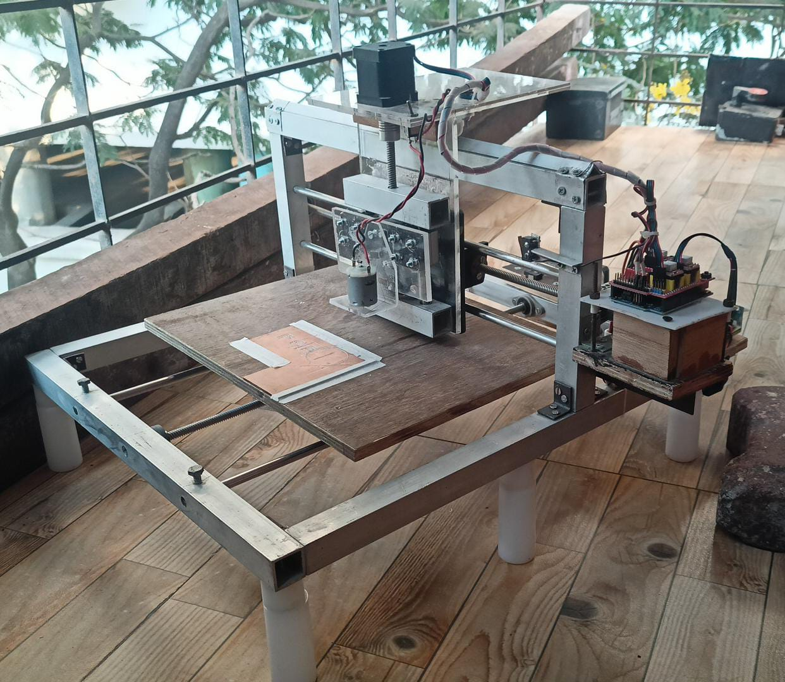

# PCB_milling_machine 

[Visit Project Link](https://www.hackster.io/515115/open-source-pcb-mill-build-electronics-for-everyone-b0b293)

My passion for electronics has always centered around the intricate beauty of custom circuit boards. Determined to bridge the gap 
between design and creation, I embarked on a mission to build my very own PCB milling machine – a project that would make its mark on the Hackster.io community.

## Rugged Framework – The Foundation:
Inspired by the projects and wisdom found on Hackster.io, I abandoned the typical 3D printed approach for a more robust design. 
My focus shifted to sturdy 1-inch square aluminum pipes for the frame. These would provide unyielding rigidity and precision for the critical movements to come.

## Mechanics of Motion – Precision and Power:
Instead of linear rails, I carefully sourced 8mm steel rods and matching linear bearings for silky-smooth axis movement. 
To drive this movement, I harnessed 8mm lead screws paired with the reliable pull of NEMA-17 stepper motors. 6mm acrylic sheets were cut and shaped 
to provide rigid mounting faces, completing this robust mechanical assembly.

## The Brains and the Brawn – Control and Drive:
At the heart of this machine would reside the versatile Atmega328p microcontroller, bringing intelligence and control to the build. 
Paired with A4988 stepper motor driver modules, I had the means to orchestrate the precise choreography of the milling process.

# Documenting the Journey – Sharing on Hackster.io:

I meticulously listed materials, shared design files, and unraveled the step-by-step instructions needed to replicate this build. 
Sharing my project ignited a sense of accomplishment and a deep connection with the maker community, allowing me to support and learn from my fellow enthusiasts.
Building my own PCB milling machine was more than just the final product. It was the thrill of customizing a solution, developing new skills, and understanding 
the dance between design and execution. Sharing my experience on Hackster.io ignited a passion to inspire and collaborate, celebrating the endless possibilities of the maker movement.

# Things used in this project
## *Hardware components:*

- ATmega328PB microcontroller	
- Microchip ATmega328PB microcontroller ×	1	
- Stepper motor driver board A4988	
- SparkFun Stepper motor driver board A4988 ×	3	
- SparkFun FTDI Basic Breakout - 5V	
- SparkFun FTDI Basic Breakout - 5V ×	1	
- Nema-17 stepper motor 4.5 kgcm high Torque ×	3	
- copper clad board ×	1	
- aluminum square pipes 1 inch ×	1	
- Lead screws 8mm diameter ×	1	
- steel rod 8mm ×	1	
- linear bearings ×	10	

## *Software apps and online services:*

- EasyEDA
- FlatCam
- Universal G-Code Sender

